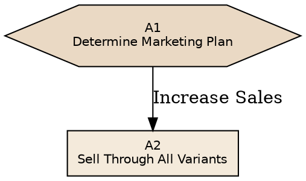

# Grounding and toolchain — data before design

The reference artifacts are built on real material: a real client process, a real paper
with re-derivable numbers. A beautiful shell around invented content is the flagship
failure mode. Ground first, render second.

## The DATA discipline

Before styling anything, extract everything the page will show into explicit data
structures (a JS `const DATA = {...}` in the artifact, or a JSON file you generate from):

- **Quotes**: verbatim, with source, year, and type. Tag each `REAL` (verbatim),
  `PARAPHRASED` (compressed, checked against the original), or `ILLUSTRATIVE`
  (constructed for exposition). Render the tag — the badge is only honest if the
  tagging step happened.
- **Numbers**: computed, not typed from memory. Run the computation in a script and
  paste results:

```bash
python3 - <<'EOF'
# e.g. sparkline coords, survival percentages, matrix cell values
vals = [0.42, 0.38, ...]
w, h, pad = 120, 32, 3
lo, hi = min(vals), max(vals)
pts = [(round(i/(len(vals)-1)*w,1),
        round(h-pad-(v-lo)/(hi-lo or 1)*(h-2*pad),1)) for i,v in enumerate(vals)]
print(" ".join(f"{x},{y}" for x,y in pts))
EOF
```

- **Relationships** (graphs, matrices, timelines): as adjacency/edge lists with ids,
  never as already-drawn coordinates. Layout comes later, from a tool.
- **Provenance footer**: write it from the DATA extraction step — what came from where,
  what was computed, what was resampled. If you can't write this paragraph, the
  grounding step isn't done.

Charts and widgets then render from DATA via a function (see `kit/behaviors/`), never
from hardcoded SVG paths. This keeps tabs/steps honest (same renderer, different slice)
and makes the numbers auditable.

## Graph layout: use Graphviz, don't hand-place

Hand-placing nodes caps out around 15 and produces crossings. For anything larger,
generate layout locally and wrap it with the interaction layer:

1. **Author DOT** with meaningful ids and per-node semantics:



2. **Render**: `dot -Tsvg flow.dot -o flow.svg` (install: `brew install graphviz`).
   For a horizontal variant render again with `rankdir=LR` — ship both, toggled.
3. **Inline** the SVG into the artifact. Keep the `viewBox`; drop fixed `width/height`
   attributes (or convert pt → responsive CSS width).
4. **Index**: Graphviz emits `<g class="node"><title>A1</title>…</g>` — the `<title>`
   is your node id. Build `{ id → group element }` on load.
5. **Attach behaviors**: hover-dim, detail cards, pan/zoom from `kit/behaviors/`.
   Node metadata (summary, branches, badges, open questions) lives in a separate
   `NODES` data object keyed by the same ids — DOT carries layout, DATA carries meaning.

The same pattern applies to any layout problem better solved by a tool than by eye:
use Python/networkx for force layouts, then embed the computed coordinates.

## Math and derived visuals

Anything with real geometry — sparkline paths, chart scales, heatmap levels, network
positions — gets computed in the generation script or in the artifact's own JS from raw
values. If you find yourself eyeballing an SVG coordinate that encodes data, stop and
compute it.
